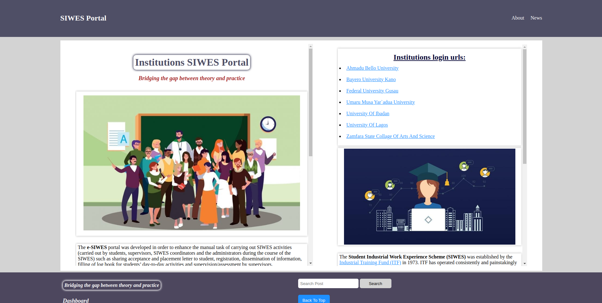

# Development of e-SIWES Portal

A web based platform for `Student Industrial Work Experience Scheme` (SIWES).

> **Note**
> This project (source code) has been totally moved to dedicated secure private place. This mean there is no any code in here! meaning it is not an open-source unlike what it was before, in the early 2023.

```sh
                  ,--,                                       
                ,--.'|           .---.                       
      .--.--.   |  |,           /. ./|            .--.--.    
     /  /    '  `--'_        .-'-. ' |   ,---.   /  /    '   
    |  :  /`./  ,' ,'|      /___/ \: |  /     \ |  :  /`./   
    |  :  ;_    '  | |   .-'.. '   ' . /    /  ||  :  ;_     
     \  \    `. |  | :  /___/ \:     '.    ' / | \  \    `.  
      `----.   \'  : |__.   \  ' .\   '   ;   /|  `----.   \ 
     /  /`--'  /|  | '.'|\   \   ' \ |'   |  / | /  /`--'  / 
    '--'.     / ;  :    ; \   \  |--" |   :    |'--'.     /  
      `--'---'  |  ,   /   \   \ |     \   \  /   `--'---'   
                 ---`-'     '---"       `----'               
```

## Introduction

A portal system can be described in different ways depending on differing point of views. To the organization that sets up the portal, it is a system that helps the organization to catalogue or organize collections of different and multiple sources of information for dissemination to many users according to their specific privileges, needs and interests. Therefore, the main purpose for setting up a portal is to bring vast information and resources available from many sources to many users in an effective manner.

The e-SIWES portal was developed in order to enhance the manual task of carrying out SIWES activities by students, supervisors, SIWES coordinators and the administrators during the course of the SIWES, such as sharing `place attachment request form letter` to student, registration, dissemination of information, filling of log book for students day-to-day activities and supervision/assessment by supervisors. The portal is web based and allows all tasks to be carried out using the personal computer/mobile device and the internet.

The digitized SIWES logbook (scan logbook in hardcopy and upload it) by students and grading by the supervisors electronically. This will allow supervisors to be assigned immediately the students commence their industrial training and facilitate their monitoring in real-time. With the e-SIWES portal, important messages can be broadcast to all students at once and on a prompt and regular basis, by staffs through the news page.

There have been several efforts in Nigeria and in other parts of the world to build portal systems that can facilitate administration and learning in higher institutions.

## Brief about SIWES

In the early stage of science and technology education in Nigeria, students were graduating from their respective institutions with little or no technical knowledge or working experience. It was in view of this that students studying science and technology related courses in different institutions were mandated to undergo the `Student Industrial Work Experience Scheme (SIWES)` so as to widen their horizons and to enable them have technical knowledge or working experience, by applying theories we get in school, in practical way, before graduating from their various institutions.

The `Student Industrial Work Experience Scheme (SIWES)` was established by the <a href="https://www.itf.gov.ng">Industrial Training Fund (ITF)</a> in _1973_. ITF has operated consistently and painstakingly within the context of its enabling laws, i.e. Decree 47 of 1971. The objective for which the Fund was established has been pursued vigorously and efficaciously. In the three decades of its existence, the ITF has not only raised training consciousness in the economy, but has also helped in generating a corps of skilled indigenous manpower which has been manning and managing various sectors of the national economy.

`SIWES` is a scheme for the duration of (6 months). Participation in SIWES has become a necessary pre-condition for the award of Diploma and Degree certificates in specific disciplines in most institutions of higher learning in Nigeria. SIWES is done after the first year in polytechnics (ND1); and done after Second year or third year in Universities depending on the institutions.

## Activities

Activities in this e-SIWES port may be independent or inter-related for the user groups. The following are some list of functional requirements for the e-SIWES portal for users base on their privileges.

-   Administrator creates accounts for all user groups.
-   Release of departmental place attachment request form.
-   SIWES coordinator assigns a set of students to a supervisor from the institution.
-   Supervise activities of students on SIWES, by comment and grade them on weekly basis.
-   Student coordinator approve student result, after supervisor submitted it.
-   Users log into the portal are identified with unique login ID & password.
-   Student print place attachment request form.
-   Student upload acceptance letter, of the Organization/Institution/Company he/she want to go.
-   Students fill logbooks, i.e scan logbook in hardcopy and upload it.
-   Users can broadcast (send and receive) messages to each other.

With this work, e-SIWES portal is now a tangible platform for efficient web based administration of SIWES tasks (activities) either the students are undergoing the program within or outside Nigeria.

This is actually a very good development both for the country and for the students. The newly developed e-SIWES portal is a timely, adequate and host of other administrative based challenges that have bedeviled the SIWES program over the years. This will help to undertake a comparative evaluation of the existing manual approach to the electronic approach for SIWES activities using the e-SIWES portal.



-   Reach <a href="https://siwesportal.onrender.com">SIWES Portal</a>
-   View <a href="https://youtu.be/4xw--DTsGi4">SIWES Portal Showcase</a>
