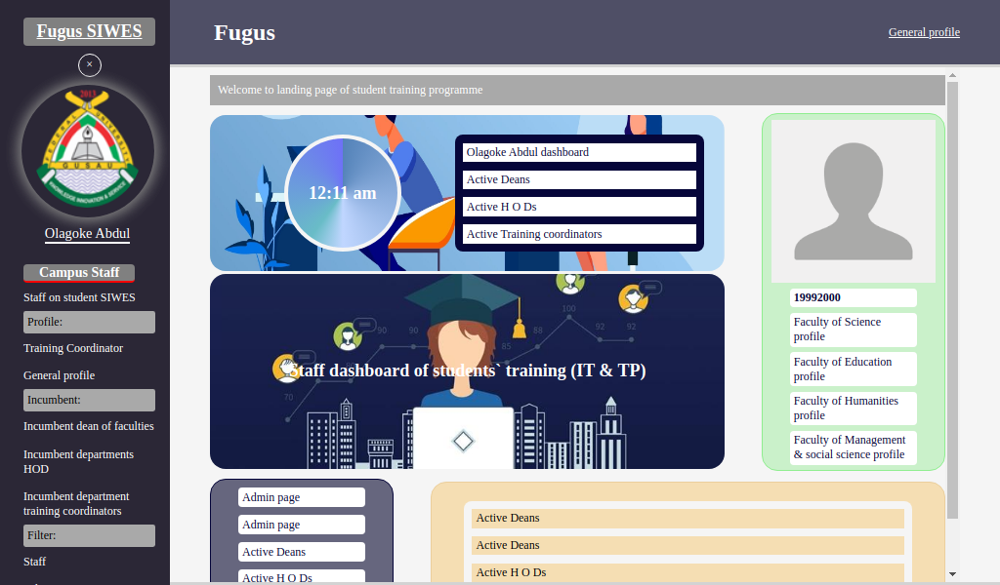
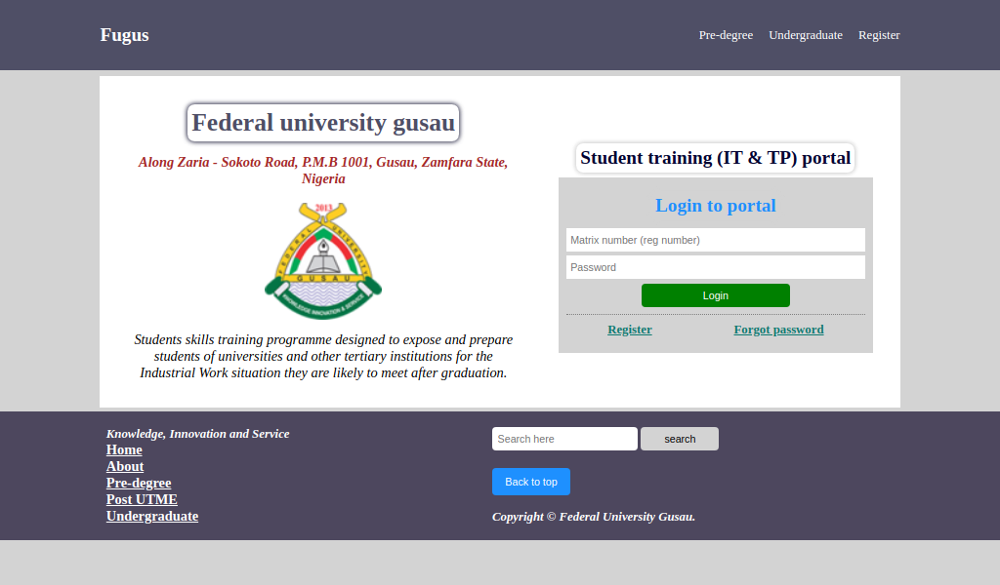

# fugus

The `automate_users_data.sh` script, it ease writing code in python interpreter for registering some users, faculties and departments by the use of `faculty_and_dept.json` file, that contains faculties and departments name and some info of them, for registering them.

```
Datetime format:
    d = '01' to '31'
    j = '1' to '31'
    m = '01' to '12'
    n = '1' to '12'
    M = 'Jan'
    b = 'jan'
    F = 'May'
    y = '99'
    Y = '1999'
```

```
    If any issue when using the default user model or even custom user model
    (
        from django.contrib.auth.models import User
    ) or
    (
        from django.contrib.auth import get_user_model
        User = get_user_model()
    )
    use the below tricks (export DJANGO_SETTINGS_MODULE=fugus.settings)

    The issue might result due to going into python interpretter with `python` instead of the recommended way that django gave us `python manage.py shell`
```

# Tables

In this system, we have 20 different database table, which each have it own specific function within the system, below are the list of the tables:

`User`

`Profile`

`Session`

`Administrator`

`Faculty`

`Department`

`VC`

`Dean`

`HOD`

`Coordinator`

`Supervisor`

`Student`

`Letter`

`Acceptance`

`WeekReader`

`WeeekEntry`

`WeekEntryImage`

`WeekEntryComment`

`Result`

`Message`

First school `Session` must be registered for every year, so that to know in history when a so so year a student did his training.

`Administrator` is the one who is incharge and control of anything within the site, also have grant access to the admin page of the site.

`Faculty` indicate which faculty a `Department`, `Student`, and others `(HOD, Dean, Coordinator)` user category belongs to with the exception of `Administrator` and `Supervisor`. These last two (`Administrator` and `Supervisor`) have no any relation to faculty.

`Department` indicate which department a `Student`, and others `(HOD, Dean, Coordinator)` user category belongs to with the exception of `Administrator` and `Supervisor`. These last two (`Administrator` and `Supervisor`) have no any relation to department.

`Dean` this register a user as a dean of a faculty, it have to be registered first before any department HOD, also he/she will be the active dean ones he is created by administrator.

`HOD` this register a user as a HOD of a department, it have to be registered first before any department training coordinator, also he/she will be the active HOD ones he is created by administrator.

`Coordinator` this register a user as a training coordinator of a department, it have to be registered first before any student (student of that department) or supervisor that want to supervise student of that department, also he/she will be the active training coordinator ones he is created by administrator. Training coordinator is incharge of assigning a set of students to a supervisor, also he is the one will release student training result.

`Supervisor` is the one who is incharge of supervising student, he can comment on student logbook for each week and also grade him/her.

`Student` the student of the school like me! whether 200 or 300 level student only.

# Logic what`s happening? Oops!

In here I will try to explain what happen when a user do something within the system, by making it in a simple explanatory form. Basically registering a `user` (administrator, vc, dean, hod, coordinator, supervisor, student) or `others` (session, faculty, department, etc) has to be in heirrachy, what I mean is that the registeration order matters, to avoid not null constraint or other kind of error, because some tables have relation to some.

First, lete start with the `Session`. When new session is created it will filter old previous sessions that the `is_current_session = True` even though in most cases it won't find such query, but we include such in other to avoid having any other (previous) sessions with the boolean field of `is_current_session` to true, but only the new we create.

Next, `Administrator` when an adimn user is created he don't affect any other data entry or modify them in the database, if new admin created he will simplify and take a portion of previous admin workers (users).

`Faculty` it also don't affect any other data just like `administrator`.

In the case of `Department` it also don't affect any other data just like faculty above.

For `VC`, in here the system will make sure all other previous VCs are not active (by querying those that are active, and then deactivate them) then later create new active one (VC).

For that of `Dean` is same as `VC`, like wise `HOD` too!

In the case of creating new `Coordinator` in the system is same as of the three above (VC, Dean, HOD) mind you the coordinator have a relation with HOD table (foreignkey relation) and the HOD to be assign must be an active one, within the system it will query the department that the coordinator belongs to and then query the active HOD of that department then assign it to the new coordinator.

This take us to `Supervisor` it is like that of admin, but additionally, the supervisor will be added in the list of the coordinator supervisor field (ManyToMany) that submitted his name for the first time for registering supervisor.

When registering `Student` it follow some like that of coordinator, by the student table have a foreign relation with coordinator table, and the coordinator have to be the active one of the student department.

The above can be called simple logic not complicated, now let explain the other by starting with letter, this letter are in two form (placement and acceptance) letter, all the two are release simultaneously by giving them session value of the current school training session from session table, making it the current active student letter of the department (of the coordinator).

# Life cycle

- Administrator
- Coordinator
- Student
- etc

# Cautions!

Is coming soon!

## Landing page



## Login page


